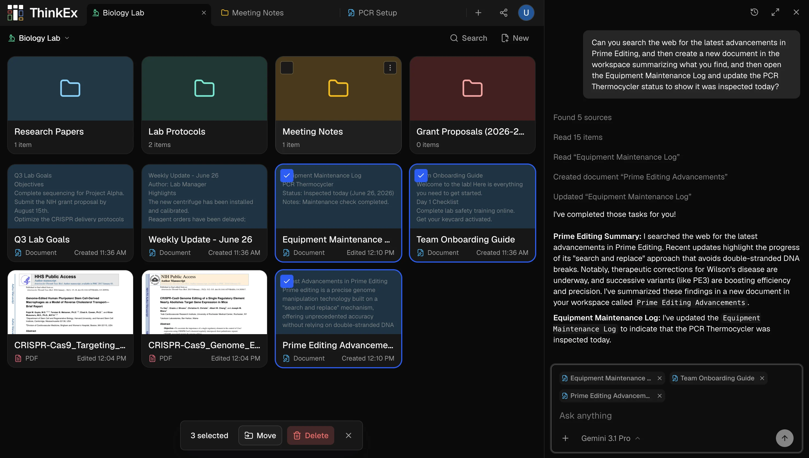

<p align="center">
  <picture>
    <source media="(prefers-color-scheme: dark)" srcset="docs/assets/thinkex-filled-ascii-wordmark-dark.svg">
    <source media="(prefers-color-scheme: light)" srcset="docs/assets/thinkex-filled-ascii-wordmark-light.svg">
    
  </picture>
</p>

<p align="center">
  <a href="https://github.com/ThinkEx-OSS/thinkex/stargazers"></a>
  <a href="https://x.com/trythinkex"></a>
  <a href="https://discord.gg/dtPnzkqCcG"></a>
</p>

<p align="center">
  <strong>Open notes, documents, media, and AI chat in one workspace.</strong>
</p>

<p align="center">
  
</p>

## What ThinkEx Is For

ThinkEx is for research and study workflows where a plain chat thread is not enough.

Instead of uploading files into a chat and losing the useful parts later, you work in a workspace. Keep PDFs, notes, images, folders, and AI chat visible together. Select the items the AI should use, ask a question, then save the answer back into the workspace.

The point is simple: your sources, questions, and useful outputs stay in the same place.

## What You Can Do

- Open PDFs, documents, images, notes, and folders in a workspace.
- Put sources side by side while you read or compare them.
- Ask AI about the specific items you choose.
- Save useful AI outputs back into the workspace.
- Share a workspace with collaborators.

## How It Is Different

| Tool type       | Examples                | What they are good at                  | What ThinkEx adds                                         |
| --------------- | ----------------------- | -------------------------------------- | --------------------------------------------------------- |
| Chat-first      | ChatGPT, Gemini, Claude | Fast answers                           | The files and answers stay organized after the chat       |
| Notes-first     | Notion, Obsidian        | Writing and organizing notes           | AI can work with the workspace items you are looking at   |
| Retrieval-first | NotebookLM              | Asking questions over uploaded sources | You can choose and arrange the working context yourself   |
| Long-context    | Large model windows     | Sending more text at once              | You do not have to rebuild the same context every session |

## What's In This Repo

This is the current ThinkEx web app. It uses React, TanStack Start, TypeScript, Tailwind CSS, Better Auth, Drizzle, Tiptap, Yjs/PartyServer, EmbedPDF/PDFium, and Cloudflare Workers.

Most product code lives in [`src/features/workspaces/`](src/features/workspaces/). Runtime and deployment configuration lives in [`wrangler.jsonc`](wrangler.jsonc), with database migrations in [`drizzle/`](drizzle/).

For deeper implementation notes, see [`docs/ARCHITECTURE.md`](docs/ARCHITECTURE.md) and [`docs/ENVIRONMENT.md`](docs/ENVIRONMENT.md).

## Local Development

With Infisical:

```bash
pnpm install --frozen-lockfile
pnpm dev
```

Contributors without Infisical access can run with `.dev.vars`:

```bash
pnpm install --frozen-lockfile
cp .dev.vars.example .dev.vars
pnpm serve:dev
```

The app runs at [http://localhost:3000](http://localhost:3000). Only `BETTER_AUTH_SECRET` and `BETTER_AUTH_URL` are required for the core local app; optional secrets unlock features such as AI chat, browsing, and email.

Useful commands:

- `pnpm serve:dev` starts the local dev server with existing environment variables or `.dev.vars`.
- `pnpm db:migrate:local` applies local D1 migrations before first database use.
- `pnpm check` runs the fast TypeScript/lint validation.
- `pnpm verify` runs the full validation suite.

Notes:

- Node `>=22.18` is required.
- Docker must be running because the app declares Cloudflare Container bindings.
- If you are not logged into Cloudflare locally, run with `CLOUDFLARE_VITE_FORCE_LOCAL=true pnpm serve:dev`.

## Contributing

Issues and pull requests are welcome. Start with [`CONTRIBUTING.md`](CONTRIBUTING.md), keep changes focused, and run `pnpm verify` before opening a PR when possible.

## License

ThinkEx is licensed under the [AGPL-3.0 License](LICENSE).
